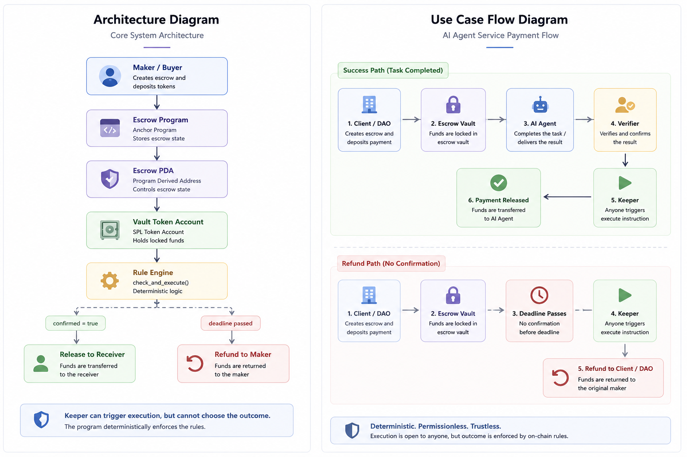

# Deterministic Payment Infrastructure for Autonomous Systems

### Permissionless execution. Deterministic settlement.

Agent Escrow is an on-chain payment primitive built on Solana using Anchor and SPL Token.

It enables AI agents, DAOs, freelancers, and autonomous marketplaces to execute escrow-based payments without relying on centralized intermediaries or discretionary settlement operators.

Funds are locked inside PDA-controlled vaults and can be executed by anyone, while the smart contract deterministically decides whether funds should:

* release to the receiver
* refund to the maker
* reject execution

based entirely on on-chain state and predefined rules.

This creates a machine-compatible settlement layer for autonomous economic systems.

---

# Why This Matters

Autonomous systems can generate work, coordinate tasks, and interact with users — but payment settlement is still often handled through manual trust.

Today, service payments and bounty payouts usually depend on:

* centralized custody
* manual approval
* multisig coordination
* platform-controlled dispute resolution
* off-chain agreements that are hard to enforce programmatically

This does not scale well for AI agents, decentralized teams, or permissionless marketplaces.

Agent Escrow introduces a deterministic settlement model:

> Anyone can trigger execution, but only the program can decide the outcome.

The keeper, bot, or user that calls the execution instruction does not control where funds go. Settlement is enforced by contract state, deadline logic, and predefined rules.

---

# Why Solana

Solana is well suited for agent-compatible payment infrastructure because it enables:

* low-cost settlement
* fast finality
* high-frequency execution
* composable program interactions
* practical payment flows for small-value tasks

For autonomous agents and decentralized work systems, settlement needs to be fast, cheap, and scriptable.

Solana makes this type of deterministic payment execution practical.

---

## Demo

[Watch the Demo Video](https://www.youtube.com/watch?v=6AV1pOrRklc)

This demo shows:
- deterministic escrow settlement
- permissionless execution
- refund-after-deadline logic
- unauthorized verifier protection
- double execution prevention

---

## Founder Pitch

https://youtu.be/AAWAlwlXKPM

---

# Architecture & Use Case Flow



The system separates execution from decision-making.

A keeper or automation script may trigger `check_and_execute`, but the program decides whether to release, refund, or reject based on escrow state.

```text
Maker / Buyer
      |
      | make() + deposit tokens
      v
Escrow Program
      |
      | stores state
      v
Escrow PDA
      |
      | controls
      v
Vault Token Account
      |
      | check_and_execute()
      v
Rule Engine
      |
      |-----------------------------|
      |                             |
confirmed = true            deadline passed
      |                             |
      v                             v
Release to Receiver          Refund to Maker
```

Core rule:

```text
Keeper triggers execution.
Program decides the outcome.
```

---

# Core Flow

## 1. Create Escrow

The maker deposits SPL tokens into a PDA-controlled vault.

The escrow stores:

* maker
* receiver
* verifier
* mint
* amount
* deadline
* confirmation status
* execution status

## 2. Verify Delivery

A verifier confirms that the expected service or task was completed.

Only the assigned verifier can confirm delivery.

## 3. Execute Settlement

Anyone can call the execution instruction.

The program evaluates the escrow state:

* if confirmed → release funds to receiver
* if deadline passed without confirmation → refund maker
* otherwise → reject with `NotReady`

## 4. Prevent Double Execution

Once settlement is completed, the escrow is marked as executed to prevent repeated execution.

---

# Use Cases

## 1. AI Agent Service Payment

A client hires an AI agent to complete a task such as research, data analysis, reporting, or workflow automation.

The client deposits payment into escrow.

When the work is verified, funds are released automatically to the agent or service provider.

If the task is not verified before the deadline, the funds can be refunded.

This enables AI agents to participate in payment flows without relying on centralized platforms or manual settlement.

---

## 2. DAO Bounty Settlement

A DAO creates a bounty for a contributor, developer, designer, moderator, or researcher.

Instead of relying on manual multisig coordination for every payout, funds are locked into escrow with a verifier and deadline.

If the contribution is confirmed, funds are released.

If no confirmation happens before the deadline, the funds return to the DAO treasury.

This provides a lightweight payment primitive for DAO-native work coordination.

---

## 3. Freelancer & Service Escrow

A freelancer and client agree on a service payment.

The client locks funds into escrow.

A verifier confirms completion, or the deadline acts as a fallback path.

This reduces counterparty risk and makes cross-border service settlement more predictable.

---

# Core Features

* PDA-controlled escrow state
* SPL Token vault custody
* permissionless execution trigger
* deterministic release / refund logic
* verifier-based confirmation
* deadline-based refund path
* double-execution protection
* localnet and devnet-compatible workflow
* frontend wallet integration
* automation scripts for buyer, verifier, and keeper roles

---

# Technical Stack

* Solana
* Anchor
* Rust
* SPL Token
* TypeScript
* Wallet Adapter
* Vite / React frontend

---

# Project Layout

```text
agent-escrow/
├── programs/agent_escrow/src/lib.rs
├── tests/agent-escrow.ts
├── scripts/buyer-agent.ts
├── scripts/verifier-agent.ts
├── scripts/keeper-agent.ts
├── app/
├── docs/
│   ├── architecture.png
│   ├── CODE_LINE_BY_LINE_ZH.md
│   ├── code_walkthrough.md
│   ├── code_walkthrough_zh.md
│   └── frontend_to_chain_call_flow_zh.md
├── Anchor.toml
├── package.json
├── tsconfig.json
└── README.md
```

---

# Install and Run

## Install dependencies

```bash
npm install
```

## Build the program

```bash
anchor build
```

## Run tests

```bash
anchor test
```

---

# Localnet Flow

## Start a validator

```bash
solana-test-validator
```

## In another terminal, build and deploy

```bash
anchor build
anchor deploy
```

## Run tests

```bash
anchor test
```

## Start the frontend

```bash
cd app
npm install
npm run dev
```

In the UI, users can:

* connect a wallet
* create a dev mint
* mint local test tokens
* create escrow
* confirm delivery
* execute settlement

---

# Devnet Flow

Deploy to devnet:

```bash
anchor deploy --provider.cluster devnet
```

Update the program id in:

```text
programs/agent_escrow/src/lib.rs
Anchor.toml
app/src/idl/agent_escrow.json
```

Rebuild and copy the fresh IDL to the app:

```bash
anchor build
cp target/idl/agent_escrow.json app/src/idl/agent_escrow.json
```

Use a devnet SPL mint and funded wallet.

---

# Script Usage

Set environment variables:

```bash
export ANCHOR_PROVIDER_URL=http://127.0.0.1:8899
export ANCHOR_WALLET=~/.config/solana/id.json
```

## Buyer Agent

```bash
RECEIVER=<receiver_pubkey> \
VERIFIER=<verifier_pubkey> \
MINT=<mint_pubkey> \
AMOUNT=1000000 \
DEADLINE=1735689600 \
npm run buyer-agent
```

## Verifier Agent

```bash
ESCROW=<escrow_pda> npm run verifier-agent
```

## Keeper Agent

```bash
ESCROW=<escrow_pda> npm run keeper-agent
```

---

# Frontend

The frontend supports Phantom and Solflare through Wallet Adapter.

It includes:

* connected wallet display
* current network display
* create escrow form
* escrow status lookup
* verifier-only confirmation
* permissionless execute button
* dev token helper for local testing
* transaction signatures for localnet
* explorer links for devnet

---

# Demo

Demo video coming soon.

Current validation:

* Anchor program builds successfully
* integration tests cover release and refund paths
* frontend provides the core interaction flow

---

# Future Vision

Agent Escrow can evolve into a generalized payment execution layer for autonomous systems.

Future extensions may include:

* milestone-based escrow
* partial releases
* keeper incentive markets
* AI verifier integration
* oracle-triggered settlement
* DAO-native dispute modules
* multi-token payment support
* SDK for agent marketplaces
* cross-program settlement workflows

---

# FAQ

## Why can anyone execute?

Because execution is only a trigger.

The program evaluates escrow state, confirmation status, execution status, and deadline conditions before deciding what happens.

A keeper cannot choose the outcome.

---

## Can a malicious keeper steal funds?

No.

The keeper is not part of the settlement decision.

The program decides whether to release, refund, or reject execution based on predefined rules.

---

## What happens if the buyer never confirms?

If the deadline passes without confirmation, anyone can trigger the refund path back to the maker.

---

## Is this an AI model?

No.

This project treats "Agent" as an automation actor and execution role, not as an LLM model.

It is designed as payment infrastructure that AI agents, bots, DAOs, or autonomous systems can use.

---

## Why is this useful for AI agents?

AI agents need predictable and scriptable settlement conditions.

A deterministic on-chain rule engine allows agents to interact with payments without relying on discretionary human approval.

---

## Why is this not ideal for informal offline human trade?

The contract only understands on-chain facts, signatures, timestamps, and stored state.

It does not evaluate subjective real-world disputes unless those are represented by a verifier, oracle, or additional dispute module.

---

# Positioning

Agent Escrow is not only an escrow contract.

It is a payment execution primitive for autonomous systems:

```text
Human or agent creates a payment condition.
Funds are locked on-chain.
Execution is permissionless.
Settlement is deterministic.
```

This makes it suitable for agent economies, DAO operations, freelance marketplaces, and programmable payment infrastructure.
